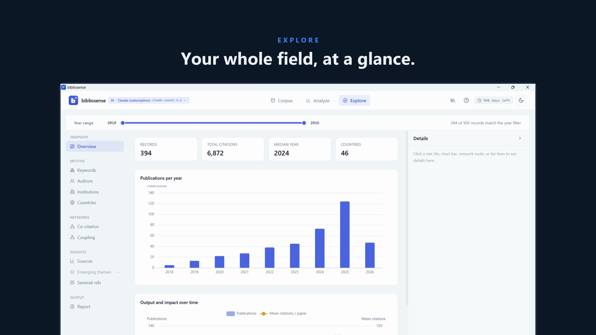

<div align="center">

# bibliosense

### From a research question to a curated, defensible corpus — analysed, visualised, and review‑ready.

**One private desktop app for bibliometric analysis, PRISMA‑guided corpus curation, AI‑assisted search across the major databases, and narrated “evolution of the field” videos.**

[](https://github.com/eamcmx/bibliosense-app/releases/latest)
&nbsp;

&nbsp;

&nbsp;


</div>

<div align="center">
  <a href="https://github.com/user-attachments/assets/8bad44b1-b15b-4d27-9bc1-fa6a43500b79">
    
  </a>
  <br><sub>▶ Watch the demo</sub>
</div>

---

## What is bibliosense?

bibliosense is a single Windows application that does the work research teams normally spread across half a dozen tools and a week of manual effort:

- **Build the corpus** — search PubMed and Scopus directly from inside the app (or import your own export from Scopus, Web of Science, Lens, or OpenAlex). An AI assistant drafts and tunes each database query against the live result count until it lands at a sensible size.
- **Run the analysis** — keyword co‑occurrence maps, author / institution / country collaboration networks, citation impact, thematic maps, research‑front detection, source productivity, and a fully written, source‑grounded narrative report.
- **Tell the story** — export a narrated “Chronicle” video that animates how your field evolved year by year: rising keywords, emerging authors and institutions, shifting themes, and the growing citation network.
- **Curate the core corpus for your review** — PRISMA 2020 identification + **AI‑assisted, human‑corroborated** screening (agreement reported as **Cohen’s κ**), open‑access full‑text retrieval, theme classification, and a publishable PRISMA flow diagram. bibliosense takes you to the screened, organised corpus your literature review is *built on* — the reading, synthesis, and writing stay yours.

> ⏱️ **Bibliometric analysis in a couple of hours, not weeks — and a PRISMA‑compliant core corpus in weeks, not months.**

Everything stays **on your machine**. Your library, your analyses, and your data never leave your computer unless you explicitly export them.

---

## Why it’s different

- **From question to corpus, in‑app.** Most tools start *after* you’ve already built a messy spreadsheet of search results. bibliosense helps you design the search itself — live, against real database counts — then fetches the records for you.
- **Defensible by default.** Every search, every count, every screening decision is recorded for a reproducible PRISMA appendix. The bibliometric narrative report grounds each statement in the actual records you provided — no invented numbers.
- **Human agency is the gate, not an afterthought.** AI accelerates the screening — it never gets the final say. You corroborate a sample of its decisions, and bibliosense scores the **AI‑to‑human agreement (Cohen’s κ)** and writes it straight into your PRISMA report. It’s a human‑in‑the‑loop checkpoint that keeps *you* in command of the evidence base — and makes your screening auditable and the corpus genuinely defensible.
- **Your field becomes a film.** No competing tool turns a literature corpus into a narrated documentary of how the field changed over time. It’s the difference between a report nobody opens and a short story a committee remembers.
- **Private by default, AI when you want it.** The core analysis runs offline. AI features are optional and use your own provider key — your corpus is never sent anywhere you didn’t choose.

---

## Download & install

➡️ **[Download the latest release](https://github.com/eamcmx/bibliosense-app/releases/latest)**

Pick **one** — all three are the same app:

| Download | Best for | Notes |
|---|---|---|
| **`bibliosense_0.7.1_x64-setup.exe`** | Most users | Standard installer · Start‑menu shortcut |
| **`bibliosense_0.7.1_x64_en-US.msi`** | IT‑managed machines | Enterprise/MSI deployment |

> **First launch may show a Windows SmartScreen notice** because the app isn’t code‑signed yet (on the roadmap). Click **More info → Run anyway**.

### System requirements

|  |  |
|---|---|
| **OS** | Windows 10 / 11 (64‑bit) |
| **Disk** | ~250 MB + space for your data |
| **RAM** | 4 GB minimum · 8 GB recommended for large corpora |
| **Internet** | Only for AI features and online full‑text retrieval — the core analysis is offline |
| **AI provider key** *(optional)* | OpenAI, Anthropic, or Mistral (Mistral has a capable free tier) |

You do **not** need any developer tools installed.

---

## Quick start

1. **Install and launch** bibliosense, then pick a mode: **Bibliometric**, **Literature Review**, or **Research Pilot** (guided search).
2. **Get your records** — let Research Pilot search PubMed/Scopus for you, or drop in an export you already have.
3. **Analyse** — click *Run analysis* for the interactive dashboards and the written report.
4. **Export** — a full report (Word / PDF / Markdown), the PRISMA package, or a narrated Chronicle video.

A full walkthrough is in **[docs/USER_GUIDE.md](docs/USER_GUIDE.md)** · see a **[sample report](docs/sample-report.pdf)** generated by the app.

---

## Pricing & licensing

bibliosense is **free to evaluate for 30 days** on first launch — full functionality, no feature gates.

After the trial, a license key unlocks continued use. **Interested in a license (individual, lab, or institutional)?** Get in touch:

💼 **[Emmanuel A. Merchán‑Cruz on LinkedIn](https://www.linkedin.com/in/emmanuel-merch%C3%A1n-444381105/)**

See **[LICENSE](LICENSE)** for the full terms. In short: all rights reserved; the analyses and reports you generate from your own data are **yours**.

---

## How to cite bibliosense

If bibliosense supported your study, please cite the software **and** disclose the AI‑assisted steps (your provider/model and the validation κ). GitHub's **“Cite this repository”** button (from [`CITATION.cff`](CITATION.cff)) gives this in APA/BibTeX too.

**Software citation (APA):**
Merchán‑Cruz, E. A. (2026). *bibliosense* (Version 0.7.1) [Computer software]. https://github.com/eamcmx/bibliosense-app

**BibTeX:**
```bibtex
@software{bibliosense_2026,
  author  = {Merchán-Cruz, Emmanuel A.},
  title   = {bibliosense},
  year    = {2026},
  version = {0.7.1},
  url     = {https://github.com/eamcmx/bibliosense-app}
}
```

**Suggested methods / acknowledgement note** (adapt the bracketed values):
> The bibliographic search and title/abstract screening were performed with the aid of *bibliosense* v0.7.1 (Merchán‑Cruz, 2026), which uses a large‑language‑model classifier to triage records against author‑defined inclusion/exclusion criteria through a configurable provider API (here, **[provider — e.g. Mistral AI, model mistral‑small]**). AI suggestions were treated as provisional: a random sample of **N = [n] ([x]%)** was independently re‑screened with the AI’s verdicts hidden, giving an inter‑rater agreement of **Cohen’s κ = [value] ([interpretation])** between the AI and the human reviewer. Final inclusion decisions rested with the author(s); the full search strategy and screening counts are reported following PRISMA 2020.

Please state the AI **provider and model** and the validation **κ**, and follow your venue’s policy on AI‑assisted tools.

---

## Support

- 📖 **[User guide](docs/USER_GUIDE.md)** · **[What’s new](CHANGELOG.md)** · **[Sample report](docs/sample-report.pdf)**
- 🐞 Found a bug or have a request? Open an [issue](https://github.com/eamcmx/bibliosense-app/issues).
- 💼 Connect: **[Emmanuel A. Merchán‑Cruz on LinkedIn](https://www.linkedin.com/in/emmanuel-merch%C3%A1n-444381105/)**

---

<div align="center">
<sub>© 2026 Emmanuel A. Merchán‑Cruz. All rights reserved. bibliosense is proprietary software distributed for evaluation; see <a href="LICENSE">LICENSE</a>.</sub>
</div>
